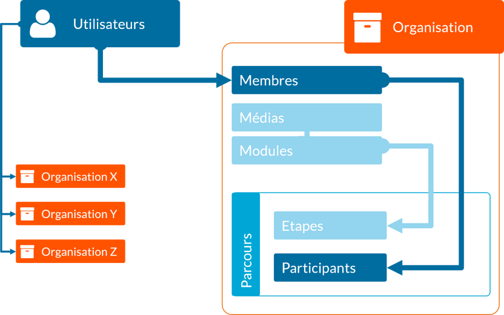

# Les principes

## L'organisation

Votre accès b-eden est articulé autour d'organisations. Chaque organisation est indépendante et personnalisable.

Elle représente un "dossier" dans lequel sont regroupés tous les éléments essentiels à la gestion de vos formations.

Une organisation contient les éléments suivants :

* Membre
* Module
* Parcours
* Média

